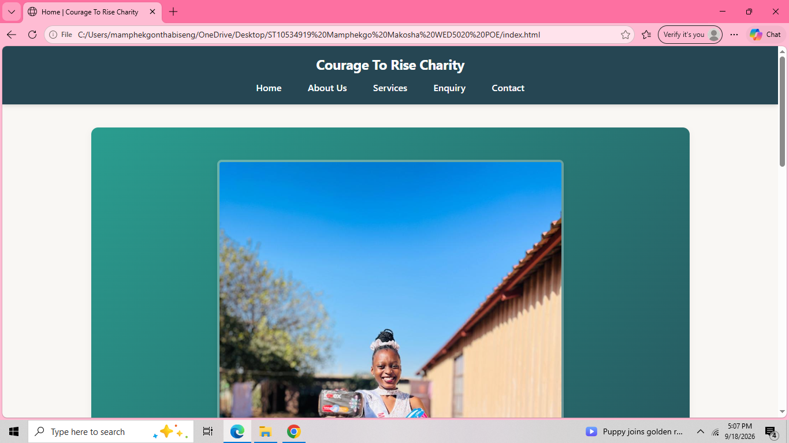
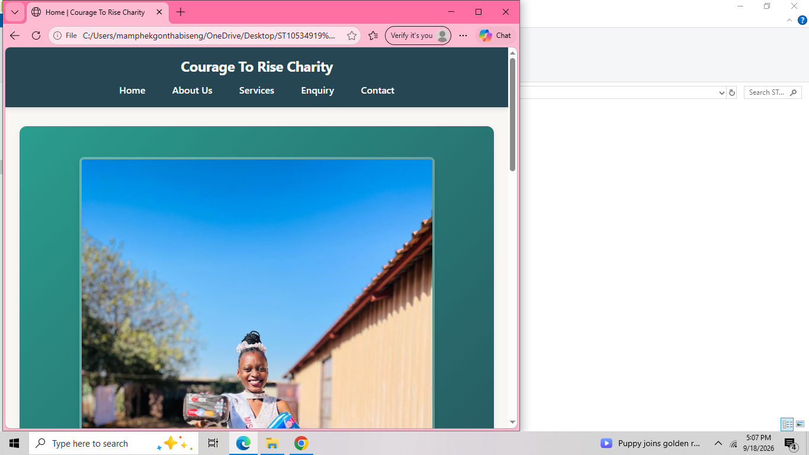
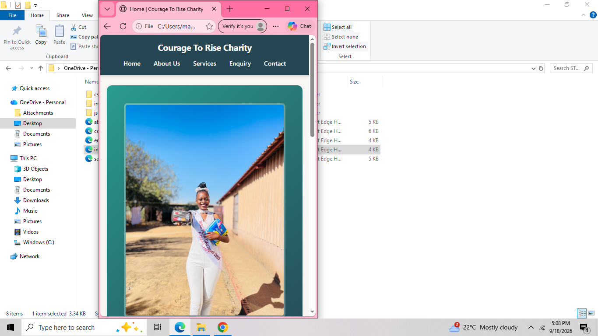

## Project Title
Courage To Rise Charity - Official Website Development

## Student Information
- **Full Name:** Makosha Dorcus Shudai Mamphekgo
- **Student Number:** ST10534919
- **Module:** WED5020 / WEDE5020 - Web Development
- **Group:** Group 7
- **Institution:** The Independent Institute of Education (Pty) Ltd - Rosebank College
- **Year:** 2026
- **Repository Link:** https://github.com/Makosha28/Mamphekgo_ST10534919_WED5020_POE/tree/main

## Project Overview
Courage To Rise Charity was started by a 19-year-old girl from Tembisa with a passion for helping others. It started as an activity from Miss Teen Gauteng beauty pageant competition, but grew into a deep connection with empowerment and giving back.

Lucia noticed that many children from townships and rural areas live in fear - fear of unknown, failure and judgment - and let it make decisions for them. Courage To Rise is becoming a voice against fear through educational programs about fear and making donations with the help of the community and MMR bakery.

The charity currently has **no website**, only personal social media platforms (Lucia's personal moments and her mother's TikTok business/Christian account). This makes it hard for donors, volunteers, and beneficiaries to find banking details, location, and authentic information.

This project will develop a professional, responsive website that serves as the official information hub for the charity. The website will tell Lucia's journey, attract donations, and empower young people.

**Target Audience:**
- People who do not believe in themselves / with no confidence
- Potential donors and sponsors
- Orphanages and youth in townships/rural areas
- Community members who want to volunteer

## Website Goals and Objectives

**Primary Goal: Providing Valuable Information**
The goal is to provide information about the charity and Lucia's journey for those who visit with the intention of being empowered to achieve whatever they want to achieve.

**Specific Objectives:**
1. **Credibility & Trust:** Build a professional online presence that shows legitimacy (instead of only personal social media).
2. **Donation Conversion:** Make it easy to donate - provide clear Banking Details, Location, and Contact Details. **KPI: 80% of website visitors donate something.**
3. **Awareness:** Let those who were not aware of the brand be aware.
4. **SEO & Findability:** Be well-structured and Search Engine Optimized so people can find us on Google.
5. **Easy Navigation:** Provide easy navigation for everyone who wants to support Lucia's journey.

## Key Features and Functionality

- **Home Page:** Touchy code at top, big warm picture that attracts donations, storyline, introduction to charity, small information about the charity with picture of owner.
- **About Us Page:** History of Organisation, Mission and Vision, Team Members' Pictures
- **Services Page:** What we offer and the pictures, Information about what we offer (educational programs about fear, donation drives)
- **Enquiry Page:** A form of details, A form for funding period (Enquiry / Donation form)
- **Contact Page:** Locations of the place and the Map, Banking Details, Contact details, Social Media Platforms links
- **Core Functionality:** Donation CTA buttons, Responsive navigation (3-line hamburger menu, options on left-hand side), Fast loading

## Timeline and Milestones

 | Period | Milestone | Deliverable |
 | :--- | :--- | :--- |
 | July 2026 | Research & Organisation Approval | Chose Courage To Rise Charity, interviewed founder |
 | July 2026 | Proposal & Planning | Website Proposal Document completed |
 | July 2026 | Sitemap & Wireframes | Created sitemap diagram and Figma wireframes |
 | July 2026 | Part 1 Development | 5 HTML pages (Home, About, Services, Enquiry, Contact) + CSS |
 | July 2026 | Part 1 Submission | Push to private GitHub repo + Submit Proposal on Learn |
 | September 2026 | Part 2 - Styling & Responsive | Implement colour scheme, typography, media queries |
 | September 2026 | Part 2 - JavaScript | Form validation, lightbox gallery |
| October 2026 | Part 3 - SEO & Testing | Lighthouse test, optimise images, meta tags |
 | October 2026 | Final Deployment | Deploy to GitHub Pages / Netlify, Final README, Demo Video |

**Budget:** R2000 - R2500 (Domain renewal, hosting, data)

## Part 1 Details

This repository contains Part 1:

1. **HTML Structure (5 Pages):**
    - `index.html` - HomePage with introduction and charity owner picture
    - `about.html` - The History, Mission and Vision, Team
    - `services.html` - What we offer and pictures
    - `enquiry.html` - Form of details + funding form
    - `contact.html` - Location, Map, Banking Details

2. **CSS:** /css/style.css - External stylesheet

3. **Assets:** /images/ - Optimised photos of charity events (from proposal)

4. **Documentation:** /docs/ - Contains Website Proposal PDF

## Sitemap
## How to View the Website

1. Clone or download this repository.
2. Open index.html in any modern web browser.
3. Use the navigation menu to move between pages.

## Changelog

### 13 September 2026
**Improvements after Formative 1 feedback**
-Added comments to my code
- Added comprehensive HTML comments explaining every major section of code
- Restructured all pages with proper semantic HTML5 elements (header, nav, main, section, footer)
- Made navigation consistent and functional on every page
- Fixed incorrect social media links (Instagram / TikTok were previously swapped)
- Improved content organisation and readability
- Expanded README with full student details, goals, technical requirements, budget, timeline, changelog and references
- Corrected broken tags and incomplete markup

## References

1. MDN Web Docs – HTML elements reference.  
   https://developer.mozilla.org/en-US/docs/Web/HTML/Element  
   (Used for correct semantic HTML5 structure)

2. W3C HTML5 Specification.  
   https://www.w3.org/TR/html52/  
   (Guidance on document structure and accessibility)

3. Google Maps Platform – Embed a map.  
   https://developers.google.com/maps/documentation/embed/get-started  
   (Used for location maps on the Contact page)

4. IIE / Rosebank College – WEDE5020 Module Guide and Assessment Rubric 2026.  
   (Official requirements for Formative 1 / POE Part 1)

5. Courage To Rise Charity – Information obtained through interview with founder Lucia and community sources (primary research).

6. “We Rise by Lifting Others” – Quote attributed to Robert Ingersoll (public domain / commonly cited motivational 

# Part 2
## Changelog

### (Part 2 – CSS & Responsive Design)

- Created external stylesheet css/style.css and linked it correctly to **all five** HTML pages.
- Applied a consistent base style (font family, font size, colour scheme, margins/padding, CSS reset).
- Implemented comprehensive typography styles (font-family, font-size, font-weight, line-height, letter-spacing).
- Built a clear layout structure using Flexbox for the navigation and overall page flow.
- Applied visual styles: colour palette (teal #2A9D8F, deep navy #264653, warm coral #E76F51, cream background), borders, box-shadows, and rounded corners.
- Added interactive pseudo-classes (:hover, :focus, :active) on navigation links and anchors.
- Implemented full responsive design with media queries for:
  - Desktop (default + large screens ≥ 1100px)
  - Tablet (≤ 768px)
  - Mobile (≤ 480px)
- Used relative units (rem, %) throughout for better scalability.
- Images scale responsively (max-width: 100%).
- Navigation stacks vertically on very small screens for better usability.
- Updated this README with Part 2 information, expanded Changelog and References.

**Improvements to Formative 1 feedback**

-Updated my README file
- Added HTML comments explaining every major section of code on all pages.
- Restructured all pages with proper semantic HTML5 elements (header, nav, main, section, article, footer).
- Made navigation consistent and functional on every page.
- Fixed incorrect social media links (Instagram / TikTok were previously swapped).
- Improved content organisation and readability.
- Expanded README with student details, goals, technical requirements, budget, timeline, changelog and references.
- Corrected broken tags and incomplete markup.

## Technical Requirements (Part 2)

- **External CSS:** Single stylesheet (css/style.css) linked from every page.
- **Base styles:** CSS reset, consistent font stack, colour scheme, spacing.
- **Typography:** Clear hierarchy with consistent sizing and line-height.
- **Layout:** Flexbox used for navigation and overall page structure.
- **Visual design:** Cohesive colour palette, shadows, rounded corners, accent borders.
- **Interactivity:** :hover, :focus and :active states on links.
- **Responsive:** Media queries at 768px and 480px breakpoints; relative units (rem, %).
- **Images:** Responsive (max-width: 100%; height: auto).

---

## Colours Used

| Role              | Hex       | Description              |
|-------------------|-----------|--------------------------|
| Primary (Teal)    | `#2A9D8F` | Hope, growth, trust      |
| Dark (Navy)       | `#264653` | Header / footer / headings |
| Accent (Coral)    | `#E76F51` | Calls-to-action, energy  |
| Background        | `#F9F7F4` | Warm off-white           |
| Text              | `#333333` | High readability         |
| White             | `#FFFFFF` | Content cards            |

## Desktop View

## Tablet view

## Mobile view

git add images/desktop-view.png images/tablet-view.png images/mobile-view.png README.md
git commit -m "Part 2: Add responsive design screenshots to README"
git push

## References

1. MDN Web Docs – CSS Reference.  
   https://developer.mozilla.org/en-US/docs/Web/CSS  
   (Used for properties, Flexbox, media queries and responsive techniques)

2. MDN Web Docs – HTML elements reference.  
   https://developer.mozilla.org/en-US/docs/Web/HTML/Element  
   (Semantic HTML5 structure)

3. W3C CSS Specifications.  
   https://www.w3.org/Style/CSS/  
   (Cascading and cascade order understanding)

4. Google Maps Platform – Embed a map.  
   https://developers.google.com/maps/documentation/embed/get-started  
   (Location maps on Contact page)

5. IIE / Rosebank College – WEDE5020 Module Guide and Assessment Rubric 2026.  
   (Official requirements for Part 1 and Part 2)

6. Courage To Rise Charity – Primary information obtained through interview with founder Lucia and community sources.

7. “We Rise by Lifting Others” – Quote attributed to Robert Ingersoll (public domain / commonly cited motivational quote).

**End of README**  
Last updated: September 2026  
Student: Makosha Dorcus Shudai Mamphekgo (ST10534919)
git add README.md
git commit -m "Part 2: Update README with detailed Changelog, colour palette, technical requirements and references"
